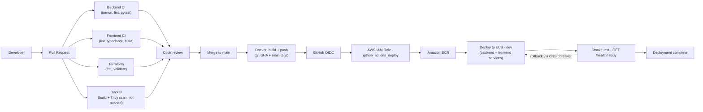

# CI/CD

How code gets from a feature branch to a running AWS service, what runs
where, what's required to set it up, and how to debug it when it breaks.

## 1. CI architecture



Four workflows, each doing one thing:

| Workflow | Triggers | Purpose |
|---|---|---|
| `.github/workflows/backend-ci.yml` | PR, push to `main` | Format check, lint, real pytest suite against real Postgres/Redis/Kafka |
| `.github/workflows/frontend-ci.yml` | PR, push to `main` | Lint, type-check, production build |
| `.github/workflows/terraform.yml` | PR, push to `main` | `fmt -check`, `validate` — no AWS credentials |
| `.github/workflows/docker.yml` | PR (build+scan only), push to `main` (build+push+**deploy**) | The only workflow that ever touches AWS |

**Pull request validation** = the first three workflows plus `docker.yml`'s
build-and-scan jobs. Nothing in a PR run — including PRs from this same
repository — ever requests AWS credentials. **Main branch validation** is
the same four workflows, but `docker.yml` additionally pushes images and
deploys. **Image publishing** and **deployment** are both inside
`docker.yml`, on push to `main` only — see the job breakdown below.

## 2-6. Workflow files

### Backend CI (`backend-ci.yml`)

Two jobs:
- **Backend Formatting & Lint** — `ruff format --check` then `ruff check`, both from `backend/requirements-dev.txt` (ruff is dev/CI-only, deliberately not in the production image — see `backend/requirements-dev.txt`'s own comment).
- **Backend Tests** — starts `postgres`, `redis`, `kafka` from the repo's own root `docker-compose.yml` (not GitHub Actions service containers — this repo's Kafka needs a specific dual-listener KRaft setup for a host process to reach it, which already exists there and is exercised daily in local dev; duplicating an equivalent as inline `services:` would just be a second, drifting copy of the same config), waits for both to be ready, runs `alembic upgrade head`, then `pytest`.

Ruff's rule selection is deliberately the classic minimal set
(`E4,E7,E9,F` — pyflakes plus basic pycodestyle), not ruff's own broader
default preset, and `E402` is explicitly ignored because
`backend/app/main.py` and `backend/app/consumers/telemetry_consumer.py`
intentionally import *after* calling
`configure_logging()`/`configure_tracing()`/`load_dotenv()`, so those take
effect before any other `backend.app` import runs. See `pyproject.toml`'s
`[tool.ruff]` section.

### Frontend CI (`frontend-ci.yml`)

One job: `npm ci` (lockfile-pinned, reproducible — not `npm install`),
`npm run lint` (oxlint), `npm run typecheck` (`tsc -b --noEmit` — added as
its own script; previously type-checking only happened implicitly inside
`npm run build`), `npm run build`. **No test framework exists in this
repo's frontend yet** — see "Known limitations."

### Terraform (`terraform.yml`)

`terraform fmt -check -recursive`, `terraform init -backend=false`,
`terraform validate`. No AWS credentials, ever, for this workflow — see
"Known limitations" for why `terraform plan` isn't wired into CI.

### Docker (`docker.yml`)

The one workflow with real AWS access. Three jobs:

1. **`build-backend`** / **`build-frontend`** — on every PR: `docker buildx build` (no push), then a Trivy scan for `CRITICAL` vulnerabilities (fails the job if any are found). On push to `main`: same build, plus push to ECR tagged `:<git-sha>` and `:main`, plus the same Trivy scan against the real pushed image.
2. **`deploy-dev`** — only on push to `main`, `needs: [build-backend, build-frontend]`. Fetches each service's current ECS task definition, renders in the new image (`aws-actions/amazon-ecs-render-task-definition`), deploys it (`aws-actions/amazon-ecs-deploy-task-definition`, `wait-for-service-stability: true`), then smoke-tests `GET /health/ready`.

## 7. ECR authentication / 8. GitHub OIDC

```
GitHub Actions (docker.yml, push-to-main only)
      │  requests an OIDC token, aud=sts.amazonaws.com
      ▼
AWS IAM OIDC provider (infrastructure/terraform/iam.tf: github_actions)
      │  trust policy checks token's "sub" claim equals
      │  repo:<github_repository>:ref:refs/heads/main  — exact match, not a
      │  wildcard (tightened as part of this change; previously matched any
      │  ref in the repo, which would have let a PR-triggered workflow
      │  assume the same role if one were ever added carelessly)
      ▼
aws_iam_role.github_actions_deploy
      │  scoped to: ecr:GetAuthorizationToken + push actions on this
      │  repo's two ECR repos; ecs:DescribeServices/DescribeTaskDefinition/
      │  RegisterTaskDefinition/UpdateService; iam:PassRole for the three
      │  ECS task roles. Nothing else — no EC2/RDS/IAM/VPC read access, so
      │  it cannot run `terraform plan`.
      ▼
Amazon ECR (push) + Amazon ECS (deploy)
```

This role and its OIDC provider **already existed** from the AWS
infrastructure work (`infrastructure/terraform/iam.tf`) before this CI/CD
change — reused here, not duplicated. **No AWS access keys exist anywhere
in this repository, in GitHub secrets, or in any workflow file.**

## 9. Image tagging

Every image pushed to ECR gets two tags: the immutable git SHA
(`robot-fleet-dev-backend:<40-char-sha>`) and the floating `main` tag. The
deploy job always deploys by SHA, never by `main` — `main` exists purely
as a convenience for `docker pull ...:main` during manual debugging, never
referenced by the deploy job itself. This means you can always answer
"exactly which commit produced the image currently running in dev" by
reading the ECS task definition's image URI.

PR builds get a `pr-<number>` tag but are **never pushed anywhere** — they
exist only inside that CI run, to prove the build succeeds and pass the
Trivy scan.

Both ECR repositories (`infrastructure/terraform/ecr.tf`) are
`IMMUTABLE` — once a tag is pushed, AWS itself refuses to let it be
overwritten.

## 10. Deployment flow

```
push to main
   │
   ├─ build-backend  ──┐
   ├─ build-frontend ──┤
   │                    ▼
   │              deploy-dev (environment: dev)
   │                    │
   │                    ├─ render + deploy backend task definition
   │                    ├─ wait for backend service stability
   │                    ├─ render + deploy frontend task definition
   │                    ├─ wait for frontend service stability
   │                    └─ curl {APP_HEALTH_URL}/health/ready, retrying
   │                       10x/10s
   │
   └─ (any job failing stops the pipeline — nothing downstream runs)
```

Both ECS services have `deployment_circuit_breaker { enable = true,
rollback = true }` (added to `infrastructure/terraform/modules/compute/
services.tf` as part of this change — it didn't exist before and without
it, a task definition that never passes its health check would just sit
there forever instead of failing). That means: if the new task definition
never reports healthy, ECS gives up after enough failed attempts,
automatically reverts the service to the last known-good task definition
on its own, and the GitHub Actions `wait-for-service-stability` step fails
promptly instead of hanging until the job times out.

## 11. GitHub environments / 12. Production approval

Only a `dev` GitHub Environment is used today (`deploy-dev` job's
`environment: dev`), matching the one AWS environment that actually exists
(`infrastructure/terraform/environments/dev.tfvars`). There is
**no `staging` or `production` environment, no manual-approval-gated job,
and no automatic production deployment** — because there's no staging/prod
AWS infrastructure for it to deploy to yet. Building an approval-gated
`production` job now that silently deployed to the same dev cluster would
be misleading; building one that always fails would just be dead code. See
"Known limitations" for the concrete extension path once real staging/prod
Terraform environments exist.

**Configure now** (needs a GitHub UI action — not something this PR can do
on your behalf): create a `dev` GitHub Environment (Settings → Environments)
and add these three as **environment variables** on it (Settings →
Environments → dev → Variables), sourced from `terraform output` after
`apply`:

| Variable | Source |
|---|---|
| `AWS_DEPLOY_ROLE_ARN` | `terraform output -raw github_actions_deploy_role_arn` |
| `AWS_REGION` | whatever `aws_region` you applied with (default `us-east-1`) |
| `APP_HEALTH_URL` | `terraform output -raw app_url` |

(Repository-level variables of the same names also work if you'd rather
not set up an Environment yet — the workflow reads `vars.*`, which
resolves to environment-scoped variables when the job declares
`environment:`, or repo-level ones otherwise.)

## 13. Rollback procedure

Because every deploy is by immutable SHA, rolling back is "deploy the
previous SHA," not a special operation:

1. Find the last known-good SHA — either the previous successful run of
   `docker.yml` in the Actions tab, or `git log --oneline main`.
2. Re-run the **`deploy-dev`** job manually (Actions → the workflow run for
   that commit → "Re-run jobs" → "Re-run failed jobs" or the whole run),
   which re-renders and re-deploys that exact image SHA — nothing needs to
   be rebuilt, since the image is already in ECR immutably.
3. Alternatively, from a local machine with AWS credentials:
   ```bash
   aws ecs describe-task-definition --task-definition robot-fleet-dev-backend --query taskDefinition > td.json
   # edit td.json's image field to the previous SHA, or use the render action's
   # logic by hand, then:
   aws ecs register-task-definition --cli-input-json file://td.json
   aws ecs update-service --cluster robot-fleet-dev-cluster --service robot-fleet-dev-backend --task-definition <new-revision-arn>
   ```
4. Watch `aws ecs wait services-stable` (or the ECS console) and re-check `GET /health/ready`.
5. Keep monitoring — the circuit breaker means a *second* bad deploy on top of a rollback would also auto-revert, but it won't retroactively fix anything already wrong before you rolled back.

No automatic rollback-on-alert is implemented — only the deploy-time
circuit breaker described above. A "revert automatically if error rates
spike an hour later" mechanism would need real application-level alerting
wired to a rollback trigger, which is out of scope here and genuinely
risky to build without careful thought (see "Known limitations").

## 14. Troubleshooting

- **`backend-ci.yml`'s "Wait for Kafka" step times out**: check the `docker compose logs` step's output (runs automatically `if: failure()`) — usually a KRaft controller-quorum config issue, not a test problem.
- **`ruff format --check` fails on a PR**: run `ruff format backend/` locally (`pip install -r backend/requirements-dev.txt` first) and commit the result — don't hand-fix formatting to match ruff's opinion.
- **`docker.yml`'s AWS steps fail with "Not authorized to perform sts:AssumeRoleWithWebIdentity"**: almost always one of — (a) `AWS_DEPLOY_ROLE_ARN` isn't set as a repo/environment variable, (b) the workflow run isn't a push to `main` (the trust policy only allows that exact ref), or (c) Terraform hasn't actually been applied yet so the role doesn't exist.
- **`deploy-dev` hangs on "wait for service stability"**: shouldn't happen now that the circuit breaker is enabled (see #10) — if it does, check the ECS service's "Deployments" tab in the console for the actual stopped-reason on failing tasks (almost always a missing/wrong Secrets Manager value — see the Terraform README's own "Troubleshooting").
- **Smoke test fails but the ECS deployment itself succeeded**: `APP_HEALTH_URL` is probably wrong/stale, or the ALB's DNS hasn't propagated yet in a very fresh environment — re-run just that step.

## 15. Required GitHub repository configuration (branch protection)

**Not applied automatically** — I don't have GitHub API access or
authorization to change repository settings, and even if I did, changing
branch protection is exactly the kind of action that needs a human
decision, not a default. Configure these by hand under **Settings →
Branches → Branch protection rules** for `main`:

- [x] Require a pull request before merging
- [x] Require status checks to pass before merging — select at minimum: `Backend Formatting & Lint`, `Backend Tests`, `Frontend Lint, Typecheck & Build`, `Terraform Validation`, `Docker Build (backend)`, `Docker Build (frontend)`
- [x] Require branches to be up to date before merging
- [x] Require at least 1 approving review
- [x] Require conversation resolution before merging
- [x] Do not allow bypassing the above settings (applies rules to admins too)
- [ ] Do **not** enable "Allow force pushes" or "Allow deletions" on `main`

## 16. Required AWS IAM configuration

Already implemented in `infrastructure/terraform/iam.tf` (this task reused
it, didn't create a new one) — see #7/#8 above for the full trust-policy
and permissions breakdown. Nothing further to configure by hand beyond
running `terraform apply` and copying its outputs into GitHub (below).

## 17. Required repository secrets/variables

No **secrets** are required for CI/CD itself — OIDC replaces long-lived
AWS keys entirely, and the app's own runtime secrets (`AI_API_KEY`,
`JWT_SECRET_KEY`, DB credentials, etc.) live in AWS Secrets Manager, set up
by the Terraform in `infrastructure/terraform/secrets.tf`, never in
GitHub.

**Variables** (repository-level, or environment-scoped on the `dev`
Environment — see #12):

| Name | Value |
|---|---|
| `AWS_DEPLOY_ROLE_ARN` | `terraform output -raw github_actions_deploy_role_arn` |
| `AWS_REGION` | the region you applied with |
| `APP_HEALTH_URL` | `terraform output -raw app_url` |

## 18. Required ECR repositories

Both already defined in `infrastructure/terraform/ecr.tf`:
`robot-fleet-dev-backend` and `robot-fleet-dev-frontend`. `terraform apply`
creates them; `docker.yml` only ever pushes to them, never creates/deletes
a repository itself.

## Known limitations

- **No `terraform plan` in CI.** The existing `github_actions_deploy` IAM role is deliberately scoped to ECR+ECS only and cannot read the rest of the account (VPC, RDS, IAM, ...), so it can't run `plan`. Adding a plan-capable role is a real, separate, more sensitive decision (broad read access across the account, even if write-free) — not something to bundle into a CI/CD change without its own explicit sign-off. If you want this later: a new IAM role with `iam:GetRole`-style read-only + the relevant `Describe*`/`Get*`/`List*` actions for every resource type in the stack (or just `ReadOnlyAccess`, more simply, accepting its breadth), triggered on `pull_request` for the `infrastructure/terraform/**` path, using `hashicorp/setup-terraform`'s `terraform plan` with `-var-file=environments/dev.tfvars` and `-no-color`, posting the plan as a PR comment via `actions/github-script`.
- **No staging/production pipeline stage.** Only `dev` exists as real infrastructure. Extending this once `environments/staging.tfvars`/`prod.tfvars` exist (see the Terraform README's own "Adding staging/prod later"): duplicate `deploy-dev` as `deploy-staging` (auto, same trigger) and `deploy-production` (`environment: production` with required reviewers configured in the GitHub UI, triggered by `workflow_dispatch` with an `image_tag` input rather than automatically on push), each pointed at that environment's own cluster/service names and its own `AWS_DEPLOY_ROLE_ARN`/`APP_HEALTH_URL` variables.
- **telemetry-consumer and simulator aren't deployed by `docker.yml`.** They only exist as ECS services when `enable_kafka = true` (currently `false` in `dev.tfvars`). Once that flips, add two more render/deploy step-pairs to `deploy-dev` for `robot-fleet-dev-telemetry-consumer` and `robot-fleet-dev-simulator`, using the same backend image (just a different task family/service, matching how those two are already defined in `infrastructure/terraform/modules/compute/services.tf`).
- **No frontend test framework.** `frontend-ci.yml` runs everything that exists (lint, typecheck, build) but there's no unit/component test suite to run. Adding one (Vitest is the natural fit alongside Vite) is frontend work, not a CI/CD change, and out of scope here.
- **Frontend Docker image still runs as root.** `nginx:1.27-alpine`'s default user needs root to bind port 80. Switching to `nginx-unprivileged` + port 8080 would fix this but changes the container's exposed port and the ALB target group/health check port it's paired with — a real, coordinated change across the Dockerfile, `docker-compose.yml`, the k8s manifests, and the Terraform compute module, not something to slip into a CI/CD PR unannounced.
- **No automated secret rotation, no cross-environment secret isolation beyond naming** — both already called out in the Terraform README's own "Future production hardening tasks."
